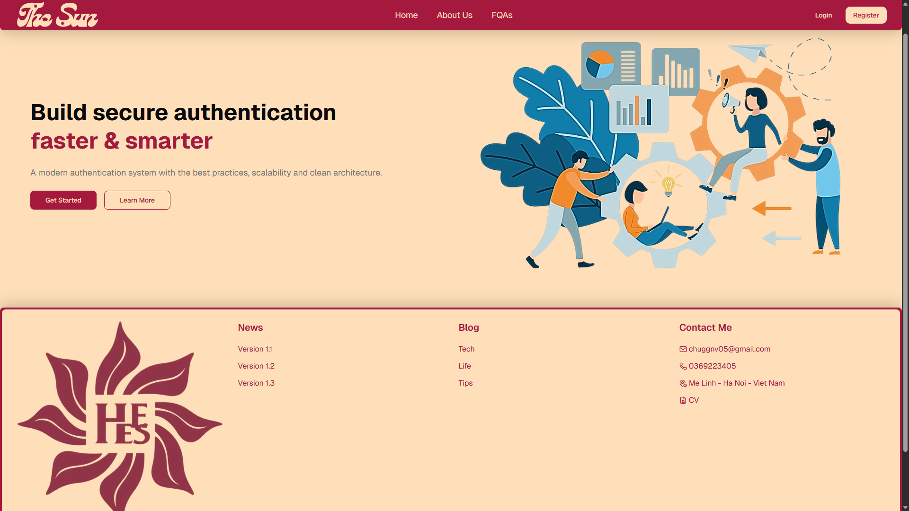

# 🚀 Auth Basic Website

## 📸 website authentication/dashboard

## ✨ About This Project

- React + TypeScript
- Vite
- React Router
- React Query
- Zustand
- TailwindCSS v4
- shadcn/ui
- React Hook Form + Zod

## 🛠️ Teah Stack

| Core       |
| ---------- |
| React 19   |
| TypeScript |
| Vite 8     |
|            |
|            |
|            |
|            |
|            |

| UI/ Styling              |
| ------------------------ |
| TailwindCSS 4            |
| shadcn/ui                |
| Radix UI                 |
| lucide-react             |
| sonner                   |
| class-variance-authority |
| tailwind-merge           |
|                          |

| State management |
| ---------------- |
| Zustand          |

| Form validation     |
| ------------------- |
| react-hook-form     |
| zod                 |
| @hookform/resolvers |

## Shadcn/ui component in project

| Component | Dùng cho            |
| --------- | ------------------- |
| textarea  | comment, Q&A        |
| form      | react-hook-form     |
| select    | dropdown            |
| dialog    | modal               |
| sheet     | mobile menu/sidebar |
| table     | dashboard           |
| tabs      | auth/profile        |
| badge     | role/status         |
| avatar    | user profile        |
| separator | divider             |
| skeleton  | loading             |
| tooltip   | hover info          |
| toast     | notification        |

## 🗿 Start

- Create .env -> copy content from .env.example -> field to .env
- npm install
- npm run build
- npm run dev
